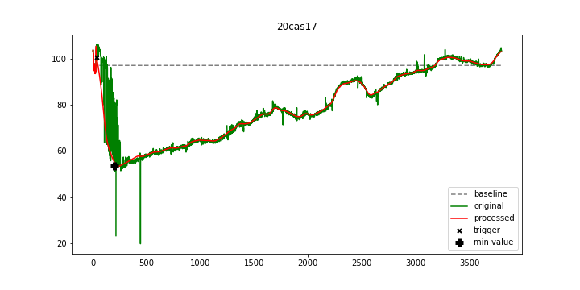

# Custom Graph Smoothening Library

These functions will help you filter noisy graphs. 
My past job was to smoothen terribly noisy pupil dilatations, and I couldn't seem to find a 
way to smoothen them on the internet. Luckily, I talked with some friends and we figured out that using
Fourier Analysis was the way to go. 

## Example:

The functions use the following libraries:
- NumPy (specifically the fft part)
- Scipy.integrate

These are mostly here to be templates, as they were tailored to my specific needs, so beware of that!

Enjoy
